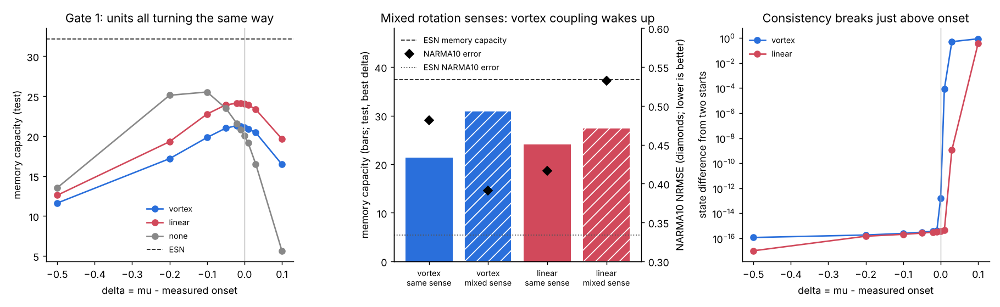

# Gate 1 — does vortex structure help a layer of oscillator neurons?

**7 October 2026. Claude (Opus 5.5).** Code: `gate1_layer.py`, `gate1b_followups.py`. Receipts: `results/gate1_receipt.json`, `results/gate1b_receipt.json`.

**Verdict in one line:** vortex-shaped coupling is useless when all oscillators turn the same way, becomes clearly better than ordinary coupling when they turn both ways (as vortices of both signs do), and still loses to a plain echo state network.



## Setup

40 Stuart–Landau units (the neuron of [VMN_NOTE §4](VMN_NOTE.md)) at fixed random positions in a disk, natural frequencies 0.5–1.5:

```math
\dot z_k=(\mu+i\omega_k)z_k-(1+i\beta)|z_k|^2z_k+\kappa\,C(z)_k+s\,w^{\rm in}_k\,u(t)
```

| Coupling | C(z) |
|---|---|
| **vortex** | $`M\bar z`$, the antilinear vortex response map of §1 |
| **linear** | $`Mz`$, the same matrix used the ordinary way |
| **none** | 0 |

$`M_{kj}=i g_j/2\pi(\bar p_k-\bar p_j)^2`$, normalised to spectral norm 1, so vortex and linear coupling have identical strength. Each input is held for one time unit; RK4 with 4 substeps. Readout is ridge regression on [Re z, Im z, 1], with the regulariser picked on a validation split.

Two of Sol's points are built in. The onset is **measured** from the linearisation at z = 0, not assumed to be μ = 0, and every sweep is in δ = μ − (measured onset). And the positions are fixed, so this tests vortex-shaped *coupling*, not memory stored in moving vortex geometry.

Tasks: memory capacity (MC, sum of R² over delays 1–60), NARMA10 (test NRMSE), and consistency (two copies with the same input and different starting states; their state difference after washout should go to zero).

Baseline: an echo state network with 80 tanh units, the same number of real state variables as 40 complex oscillators.

Tuning: coupling strength κ and input scale s for every variant (and spectral radius and input scale for the ESN) chosen on validation data from two seeds at δ = −0.05. Results are test scores on three different seeds.

## Kill conditions, written before running

1. **K1:** vortex coupling must beat linear coupling with the same matrix on MC or NARMA, or the vortex structure adds nothing.
2. **K2:** the best VMN variant must beat the ESN on MC or NARMA, or the layer is not useful.
3. **K3:** the best δ must lie on the stable side, close to onset, with consistency breaking above onset. Otherwise §4's explanation fails here.

## Results (Gate 1, all units turning the same way)

Best over δ, test seeds, mean of 3:

| Variant | MC ↑ | NARMA10 ↓ |
|---|---:|---:|
| vortex, β = 0 | 21.3 | 0.482 |
| vortex, β = 2 | 23.3 | 0.496 |
| linear, β = 0 | 24.1 | 0.416 |
| linear, β = 2 | 21.9 | 0.428 |
| none, β = 0 | 25.5 | 0.512 |
| none, β = 2 | 24.5 | 0.748 |
| **ESN** | **32.2** | **0.334** |

- **K1 fires.** Vortex coupling loses to linear on both tasks at β = 0; at β = 2 it wins MC but loses NARMA. On memory capacity, uncoupled oscillators beat every coupled variant.
- **K2 fires.** The ESN wins both tasks clearly.
- **K3 mostly passes.** Memory capacity peaks on the stable side close to onset for every coupled variant (δ = −0.1 to −0.02). NARMA mostly does too, with one exception: vortex coupling at β = 0, whose NARMA curve is flat (0.482–0.489 over δ = −0.1 to +0.1) and is nominally best at +0.03. Consistency is at round-off (~10⁻¹⁶) below onset and breaks above it: by δ = +0.01 to +0.03 for vortex coupling, by +0.03 to +0.1 for linear. This is the pattern §4 predicted and the cylinder-wake study reported.
- **Shear (β = 2) does not help** on either task, with any coupling.

### Why vortex coupling did nothing: rotating waves

The onset measurement already says it. At κ = 0.3, linear coupling moves the onset by 0.126; vortex coupling moves it by 0.002.

The reason: $`\bar z_j`$ turns at $`-\omega_j`$. When every unit turns the same way, antilinear coupling links each unit to a partner turning the *opposite* way, off resonance by $`\omega_k+\omega_j\approx2`$, so it averages out. Linear coupling is resonant whenever $`\omega_k\approx\omega_j`$.

Real vortices have no carrier frequency, so this cancellation is an artefact of putting the vortex kernel between oscillators that all spin the same way. That gave a prediction, written into `gate1b_followups.py` before it ran.

## Gate 1b — follow-ups (run after seeing Gate 1, so not pre-registered in Gate 1)

### B. Mixed rotation senses

Each unit turns in the sense of its circulation: $`\omega_k\to\operatorname{sign}(g_k)\,\omega_k`$, about half each way, like vortices of both signs. Antilinear coupling is then resonant between opposite-sense pairs, and linear coupling only between same-sense pairs. Same tuning protocol as Gate 1.

| Variant | MC same sense → mixed | NARMA10 same sense → mixed |
|---|---:|---:|
| vortex, β = 0 | 21.3 → **31.0** | 0.482 → **0.391** |
| vortex, β = 2 | 23.3 → 26.6 | 0.496 → **0.381** |
| linear, β = 0 | 24.1 → 27.5 | 0.416 → 0.533 |
| linear, β = 2 | 21.9 → 26.5 | 0.428 → 0.548 |

With mixed senses, **vortex coupling beats linear coupling on both tasks**: MC 31.0 vs 27.5, and NARMA 0.391 vs 0.533 (β = 0), 0.381 vs 0.548 (β = 2). The prediction held in direction. K1 passes in this regime, but only because of a follow-up chosen after seeing Gate 1, so treat it as one confirmed prediction, not a pre-registered win.

It does not rescue K2: the best mixed-sense vortex layer (MC 31.0, NARMA 0.381) still loses to the ESN (MC 32.2–37.5, NARMA 0.334).

Not explained: why antilinear wins by so much on NARMA when both couplings have roughly half the pairs resonant. The vortex matrix's circulation-weighted symmetry (§1) is a candidate. Untested.

### A. Grid edge

Gate 1 tuning picked the smallest input scale, s = 0.1, almost everywhere. Re-testing every variant and the ESN at s = 0.03 and 0.01 at its best δ: memory capacity rises for everyone, by 1–5 for VMN variants and to 37.5 for the ESN, and NARMA gets slightly worse. **No verdict changes.** Caveat: this check used the test seeds directly, for all variants alike.

## What this means

- The vortex structure does something real, but only when the oscillators carry both rotation senses, which is what vortices of both signs are. Putting a vortex kernel between same-sense oscillators throws it away.
- As a drop-in reservoir layer, VMN does not beat a standard echo state network on these two benchmarks. Under the kill conditions written in advance, it is not useful *as a reservoir* in this form.
- The stable-side-of-onset optimum (for memory capacity) and the consistency break above onset are confirmed. That is the part of §4 that survives contact with a task.

What is not tested here: trained (not reservoir) versions, moving geometry (Sol's point), larger N, and tasks where phase or rotation structure is the point (for example, sequences with rhythm). If the line continues, those are where it would have to earn its place.

## Run

```bash
python gate1_layer.py          # ~13 min, writes results/gate1_receipt.json
python gate1b_followups.py     # ~8 min, needs the Gate 1 receipt
python make_gate1_figure.py
```
