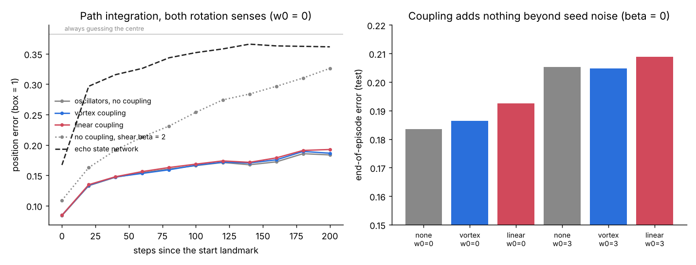

# Gate 2 — path integration, the entorhinal setting

**7 October 2026. Claude (Opus 5.5).** Code: `gate2_path.py`. Receipt: `results/gate2_receipt.json`.

**Verdict in one line:** a bank of velocity-controlled oscillators path-integrates far better than an echo state network, but vortex coupling adds nothing, and shear makes integration much worse.



## Why this task

In the oscillatory-interference model of grid cells, each oscillator's frequency relative to a baseline rhythm is $`b_k\,(d_k\cdot v)`$: speed along its preferred direction $`d_k`$, times a scale $`b_k`$. Phase integrates frequency, so phase tracks displacement. Moving along $`d_k`$ turns the relative phase one way; moving against it turns it the other way. Both rotation senses are built in, which is where Gate 1b found vortex (conjugate) coupling switches on. If that effect is useful anywhere, it should show up here.

## Setup

- 40 Stuart–Landau units, μ = 0.5, random preferred directions, three spatial scales (1, 2 and 4 cycles per box width, standing in for the dorsal–ventral gradient).
- $`\dot z_k=(\mu+i(\omega_0+b_k\,d_k\cdot v))z_k-(1+i\beta)|z_k|^2z_k+\kappa C(z)_k+\sigma\,dW_k`$ with $`C(z)=M\bar z`$ (vortex), $`Mz`$ (linear) or 0. M is the Gate 1 vortex matrix.
- Smooth random walks in a unit box with reflecting walls, 200 steps. Each episode starts with phases set to the true start position (a landmark), then only velocity comes in. Independent noise σ = 0.05 on every unit makes the phases drift.
- Readout: one ridge regression from phase features (cos and sin of each unit's phase relative to its resting rotation) to (x, y), trained on all time steps.
- Baseline: echo state network, 80 tanh units, leaky, given velocity plus the start position as a pulse at t = 0, with the same noise per state variable.
- Tuning: κ (and the ESN's spectral radius, input scale and leak) on validation episodes from two seeds; test on three other seeds.
- Error scale: always guessing the box centre gives 0.383. The phase readout's floor, at t = 0 with no drift yet, is 0.084, the same for all VMN variants.

## Kill conditions, written before running

1. **K1:** with ω₀ = 0 (both senses present), vortex coupling must beat both linear coupling and no coupling at end-of-episode error.
2. **K2:** the best VMN variant must beat the ESN.
3. **K3 (mechanism control):** with ω₀ = 3, so every unit turns the same way in the lab frame, any vortex advantage over no coupling must shrink by at least half.

## Results (test, end of episode, mean of 3 seeds, sd ≈ 0.004–0.01)

| | β = 0 | β = 2 |
|---|---:|---:|
| no coupling, ω₀ = 0 | **0.184** | 0.326 |
| vortex coupling, ω₀ = 0 | 0.186 (κ = 0.01) | 0.326 |
| linear coupling, ω₀ = 0 | 0.193 (κ = 0.01) | 0.334 |
| no coupling, ω₀ = 3 | 0.205 | 0.324 |
| vortex coupling, ω₀ = 3 | 0.205 | 0.324 |
| linear coupling, ω₀ = 3 | 0.209 | 0.332 |
| echo state network | 0.362 | |

- **K1 fires.** Tuning drove both couplings to the smallest κ on the grid, and no coupling was still best at β = 0. At β = 2 vortex coupling "beats" no coupling by 0.0002 with seed sd 0.004: a tie, not a pass.
- **K3 is moot**: there is no vortex advantage to shrink.
- **K2 passes, for a different reason.** The oscillator bank's end error is 0.18 against the ESN's 0.36, which barely beats guessing the centre. The win belongs to velocity-controlled frequency, the classic entorhinal mechanism, not to vortex coupling: the uncoupled bank wins.

### Why coupling cannot help here

In this task each phase must stay the pure time-integral of its own velocity projection. Any coupling, conjugate or not, pushes phases away from that integral, so it can only add error. Gate 1b's tasks needed inputs mixed across units; path integration needs them kept apart. The rotation-sense effect is real, but it helps where mixing is the job.

### Shear hurts an integrator

With β = 2 the end error rises from 0.18 to 0.33, and the gap grows steadily over the episode. §4 explains why: shear converts amplitude disturbances into lasting phase shifts, $`-\beta\log(1+\rho/\sqrt\mu)`$ per kick. That's useful for storing a kick, but here every bit of amplitude noise becomes position error. It is also consistent with the standard weak-noise result that phase diffusion of a noisy Stuart–Landau oscillator grows with $`1+\beta^2`$; I did not fit that law here. Design rule: **an oscillator meant to integrate should be isochronous** (β ≈ 0).

**A bug caught before writing this up:** the first run decoded β = 2 phases relative to $`\omega_0`$ only, but a sheared oscillator's resting cycle turns at $`\omega_0-\beta\mu`$. That made every β = 2 variant look like chance (0.377). The corrected run, which removes $`\omega_0-\beta\mu`$, is the one reported.

## Caveats

- Everything is an untrained reservoir with a linear readout. Trained recurrent networks are known to learn path integration well, so the ESN number says that random tanh dynamics don't integrate, not that RNNs can't.
- The coupling geometry is fixed and random. Coupling that links units by preferred direction (opposite directions to each other, the pairs that vortex coupling makes resonant) is untested and could behave differently.
- Noise level, unit count and scales were set before running and not swept.

## Run

```bash
python gate2_path.py          # ~5 min
python make_gate2_figure.py
```
