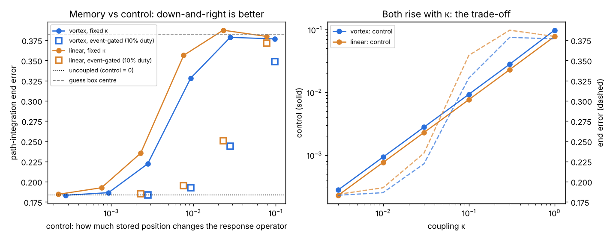

# Gate 3 — memory vs control, and event-gated coupling

**7 October 2026. Claude (Opus 5.5).** Code: `gate3_tradeoff.py`. Receipt: `results/gate3_receipt.json`. Figure: `make_gate3_figure.py`.

**Verdict in one line:** coupling buys "control" (stored position changes how the bank responds) at the direct price of memory (integration error), and switching the coupling on only at events gets about 7–9× more control than steady coupling at the same error. All three kill conditions pass.



## The claim

Gates 1 and 2 pulled in opposite directions. In Gate 1b vortex coupling helped, because there history was supposed to change how later inputs are processed. In Gate 2 every coupling hurt, because path integration needs each phase to stay a clean integral. Sol's VMN asks the Gate 1 question throughout: can a past input change the operator applied to the next one?

The claim is that these are two ends of one trade-off, fixed by symmetry:

- An **uncoupled** bank is unchanged if you rotate any one unit's phase. So every phase is a neutral direction, which makes it a perfect integrator. By the same symmetry, the response operators at two stored positions differ only by per-unit rotations, so their singular values are identical: **the operator cannot see what is stored.**
- **Coupling** breaks that symmetry. The operator starts to depend on the stored position (control), and the phases stop being pure integrators (drift).
- A refinement: ordinary coupling $`Mz`$ keeps the symmetry of rotating *all* phases together; vortex coupling $`M\bar z`$ breaks that one too. Path integration stores position in per-unit phase *differences*, so here both couplings should trade.

The general principle, that a continuous symmetry gives a neutral, memory-holding direction, is standard; it is how ring and continuous attractors work. What is new here is measuring the price of breaking it in a VMN bank, and testing whether timing the breaking helps.

## The two axes

Same bank as Gate 2: 40 Stuart–Landau units, μ = 0.5, β = 0, ω₀ = 0, three spatial scales, noise σ = 0.05, 200-step episodes, ridge readout on phases, test seeds 10–12.

- **Error:** Gate 2's end-of-episode position error, at each fixed κ.
- **Control:** for 48 positions, place every unit on its limit cycle at the true phase $`b_k\,d_k\cdot x`$. Form the exact tangent in doubled form ($`A`$, $`B`$ blocks, as in Sol's READER.md), take $`\Phi=\exp(DH)`$ with H = 2, and its singular values $`s(x)`$. Control is the mean pairwise $`\lVert s(x)-s(x')\rVert`$ divided by the mean $`\lVert s\rVert`$. It ignores rotations, so it is exactly zero for the uncoupled bank.
- **Event-gated variant:** κ = 0 between events, and κ = κ_on for 5 steps every 50 (10% duty). During an event its control equals that of κ_on; its error is measured directly.

## Kill conditions, written before running

1. **K1 (trade-off):** control is below 1e-9 at κ = 0, control rises with κ, and no κ > 0 lowers error below κ = 0 by more than 2 seed-sd.
2. **K2 (global phase):** rotating all phases together changes $`s`$ by less than 1e-9 (relative) for linear coupling, and by more than 1e-3 for vortex coupling.
3. **K3 (event gating):** for at least one κ_on, in both modes, gated control is at least 2× the control of fixed coupling at the same error. The fixed curve is interpolated.

## Results

| κ | vortex error | vortex control | linear error | linear control |
|---:|---:|---:|---:|---:|
| 0 | 0.184 | 0 | 0.184 | 0 |
| 0.003 | 0.183 | 0.00028 | 0.184 | 0.00023 |
| 0.01 | 0.186 | 0.00093 | 0.193 | 0.00076 |
| 0.03 | 0.222 | 0.0028 | 0.235 | 0.0023 |
| 0.1 | 0.328 | 0.0093 | 0.356 | 0.0076 |
| 0.3 | 0.379 | 0.028 | 0.388 | 0.023 |
| 1 | 0.377 | 0.098 | 0.380 | 0.078 |

Errors are means of 3 seeds, with seed sd about 0.005. 0.383 is the error of always guessing the box centre.

| event-gated κ_on | vortex error | control | fixed control at that error | ratio | linear error | ratio |
|---:|---:|---:|---:|---:|---:|---:|
| 0.03 | 0.184 | 0.0028 | ≈0 | (floor) | 0.185 | (floor) |
| 0.1 | 0.193 | 0.0093 | 0.0012 | **7.5×** | 0.195 | **8.9×** |
| 0.3 | 0.244 | 0.028 | 0.0041 | **6.8×** | 0.251 | **7.8×** |
| 1 | 0.349 | 0.098 | 0.046 | 2.1× | 0.372 | 1.5× |

- **K1 passes in both modes.** Control is exactly 0 without coupling, grows linearly with κ, and no coupling lowers the error. Error stays flat up to about κ = 0.01, then climbs to chance by κ = 0.3.
- **K2 passes.** A global rotation changes the singular values by 4×10⁻¹⁶ with linear coupling (rounding error) and by 3.8% with vortex coupling.
- **K3 passes.** The receipt's best ratio, 39.6×, sits at the noise floor (κ_on = 0.03, error indistinguishable from uncoupled), so I don't lean on it. The robust figures are the 7–9× ratios at κ_on = 0.1 and 0.3, where errors are clearly above noise. At κ_on = 1 the gated variant also saturates, because even 10% of the time at that coupling scrambles the phases.

### Not pre-registered: vortex beats linear on both axes

At every κ from 0.01 up, vortex coupling gives **more control and less error** than linear coupling: for example 0.0093 and 0.328 against 0.0076 and 0.356 at κ = 0.1. So on this trade-off, vortex coupling is the better way to break the symmetry. One plausible reason is K2: it also makes the common phase visible to the operator. That explanation is untested.

## What this does and does not show

- The ~10× gain from gating is roughly what you would predict if the damage scales with κ × time and duty is 10%. The measurement confirms that scaling (no large switching transients), and finds 7–9×. It is a confirmation, not a surprise.
- **Control is not usefulness.** This gate shows the operator *depends* on stored position. It does not show that any downstream task benefits. The next gate has to give the bank a task that needs a position-dependent response, such as answering a probe differently in different places, and check that gated coupling solves it while still integrating.
- Single setting: β = 0, one noise level, one duty cycle, one horizon H, untrained reservoir and readout.

## The design rule it suggests

Keep the integrator symmetric. Break the symmetry briefly, only when a response that depends on the stored state is needed. This matches the brain's division of labour in the entorhinal setting: grid phases integrate, and resets and readout happen at landmarks and downstream. It also matches Sol's one positive VMN result, where a small retained state plus known equations regenerated the response.

## Run

```bash
python gate3_tradeoff.py      # ~4 min
python make_gate3_figure.py
```
