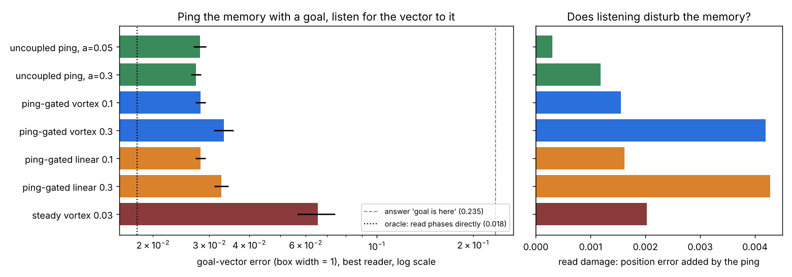

# Gate 4 — ping the memory with a goal, listen for the vector to it

**7 October 2026. Claude (Opus 5.5).** Code: `gate4_ping.py`. Receipt: `results/gate4_receipt.json`. Figure: `make_gate4_figure.py`.

**Verdict in one line:** an *uncoupled* oscillator bank that path-integrated a position can be queried by stimulating it with a goal's phase pattern. Its phase response gives the vector to the goal with error 0.027 (box width 1), the ping barely disturbs the memory, and vortex coupling adds nothing. K1 passes; K2 narrowly fails (the ping is 1.5× worse than reading the phases directly); K3 fails.



## Why this gate: Sol's correction to Gate 3

Gate 3 claimed an uncoupled bank's response operator "cannot see what is stored", because its singular values don't depend on the stored phases. **Sol showed that this is wrong.** Singular values discard directions. For a single uncoupled unit, the 2-time-unit response at phases 0 and π/2 is diag(e⁻², 1) versus diag(1, e⁻²). The singular values are identical, yet the same horizontal probe gets a response of 0.135 in one state and 1 in the other: it disturbs amplitude, which relaxes, or phase, which persists. I checked this numerically (`expm` of the exact tangent), and it holds exactly.

So stored phase *does* change how the bank answers a probe, with no coupling. Gate 3 measured something narrower: changes in response *strength*, after ignoring rotations. Sol also asked for (1) a task whose answer depends jointly on the stored state and the probe, and (2) measurement along real noisy trajectories rather than idealised states with a frozen Jacobian. This gate does both.

## The task

1. **Store:** path integration exactly as Gate 2. That is 40 Stuart–Landau units, β = 0, noise σ = 0.05, 200 steps of velocity after a start landmark.
2. **Ping:** at the end, a goal q = x + D (|D| ≤ 0.35) arrives as an instantaneous kick in the phase pattern the bank *would* hold at q: $`a\sqrt{\mu}\,e^{i\phi_k}`$ with $`\phi_k=b_k\,d_k\cdot q`$.
3. **Listen:** stand still for 4 time units, running a pinged and an unpinged copy that share the same noise. Features: each unit's phase advance at t = 1, 2, 4. To first order this is $`a\sin(\phi_k-\theta_k)`$, which is interference between the goal and the stored phase. It depends only on the displacement $`q-x`$.
4. **Read:** ridge or kNN (hyperparameters on validation) maps the features to D. Three seeds; 1000 / 300 / 500 episodes.

**Oracle:** the same readers on $`\sin,\cos(\phi_k-\theta_k)`$ computed from the actual noisy end phases. This is what a perfect, noiseless, non-disturbing ping would give.
**Read damage:** a kNN position reader trained on pre-ping phases, applied to the pinged copy after listening.

## Kill conditions, written before running

1. **K1 (coupling unnecessary):** uncoupled ping error ≤ 0.5 × the error of always answering "the goal is here" (D = 0).
2. **K2 (ping near ideal):** best uncoupled ping within 1.25× the oracle.
3. **K3 (vortex earns its place):** some vortex condition beats the best uncoupled ping by ≥ 10%, by more than 2 seed-sd.

## Results (test, mean of 3 seeds)

| condition | goal-vector error (ridge / kNN) | position error before → after ping (kNN) |
|---|---:|---:|
| answer D = 0 | 0.235 | |
| **oracle** (read phases directly) | 0.072 / **0.018** | |
| uncoupled ping, a = 0.05 | 0.071 / 0.028 | 0.0213 → 0.0216 |
| **uncoupled ping, a = 0.3** | 0.067 / **0.027** | 0.0213 → 0.0225 |
| ping-gated vortex κ = 0.1 | 0.067 / 0.028 | 0.0213 → 0.0228 |
| ping-gated vortex κ = 0.3 | 0.069 / 0.033 | 0.0213 → 0.0255 |
| ping-gated linear κ = 0.1 | 0.067 / 0.028 | 0.0213 → 0.0229 |
| ping-gated linear κ = 0.3 | 0.069 / 0.033 | 0.0213 → 0.0256 |
| steady vortex κ = 0.03 | 0.101 / 0.065 | 0.0564 → 0.0584 |

Seed sd on the kNN errors is about 0.001–0.004.

- **K1 passes, by a wide margin.** The uncoupled ping cuts goal-vector error from 0.235 to 0.027, an 8.6× improvement. Stored phase changes the probe answer usefully with no coupling at all, which confirms Sol's correction at the level of a task.
- **K2 narrowly fails.** The physical ping is 1.5× worse than the oracle (0.027 against 0.018) with kNN, so it loses about a third of the accuracy. With the linear reader, the ping actually beats the oracle (0.067 against 0.072), probably because its three time samples carry more varied features.
- **K3 fails.** Coupling switched on by the ping ties the uncoupled ping at κ = 0.1 and is worse at 0.3. Steady vortex coupling is 2.4× worse, because it already damaged the memory during integration (Gate 3). Ordinary coupling behaves the same as vortex coupling. **This is the fourth gate in which vortex coupling does not earn a place.** The only win remains Gate 1b's reservoir benchmarks.
- **Listening is nearly free.** A small ping adds 0.0003 to position error; a large one adds 0.0012. Coupling during the listen window adds up to 0.004.

## A correction to Gates 2 and 3: the linear reader understated the memory

With a kNN reader, the uncoupled bank's absolute position error at the end of the episode is **0.021, not 0.198** (the ridge figure). The phase code is periodic at three scales, so position is a strongly nonlinear function of it, and a linear reader throws most of it away. Gates 2 and 3 reported linear-reader numbers. Their comparisons still hold under kNN (steady vortex 0.056 vs uncoupled 0.021, so coupling still hurts, by 2.6×), but their absolute errors understate the bank by about 9×.

There is also a reason the code is that good. Each unit's phase drifts by **0.71 rad RMS** by the end of the episode, yet 40 units together pin position to 0.021. The noise is independent per unit while the signal is shared, so redundancy across the population corrects it. That is the error-correcting property of grid codes (Sreenivasan & Fiete 2011), here coming for free from the reader.

I also checked the tempting claim that the goal-vector readout is more accurate than absolute position. It isn't (0.027 against 0.021). That gap was entirely the linear reader.

## What this adds up to

The architecture that survives four gates:

1. **Integrate silently** in a bank of uncoupled, isochronous oscillators (β ≈ 0, Gate 2). Velocity sets each frequency, and phase holds the integral.
2. **Query by stimulation:** ping with the phase pattern of a goal, and listen to the phase advance. The answer is the displacement to the goal, and the query barely disturbs the memory.
3. **No coupling needed.** Redundancy across units does the error correction.

The ping's value is the **interface, not accuracy**. Reading the phases directly is slightly better. But the ping lets a reader that can only inject into a port and listen at it, never inspect internal state, ask "where is the goal from here?". That is the situation of a physical substrate: an analog oscillator array, a resonator chip, a fluid. Neuroscientifically none of this is new. It is the oscillatory-interference model run as a query, and goal-vector navigation from grid codes has been modelled before (Bush, Barry, Manson & Burgess 2015). As an engineering primitive for ping-queryable physical memory, it is the clearest demo the VMN line has produced.

## Caveats

- One noise level, one goal radius (0.35, within the coarsest period). Goals farther than half the coarsest period will alias.
- A shared velocity error (a biased odometer) moves every phase consistently. Neither redundancy nor pinging can detect it; Sol raised this, and it is untested here.
- The reader is trained per bank, with no transfer across banks.
- kNN is a capable but data-hungry reader (1000 training episodes).

## Run

```bash
python gate4_ping.py         # ~1 min
python make_gate4_figure.py
```
