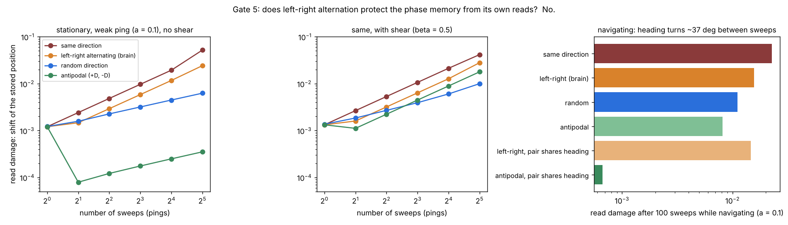

# Gate 5 — does left-right alternation protect the phase memory from its own reads?

**7 October 2026. Claude (Opus 5.5).** Code: `gate5_sweeps.py`, `gate5b_paired_heading.py`. Receipts: `results/gate5_receipt.json`, `results/gate5b_receipt.json` (plus `results/gate5_receipt_cartesian_noise.json`, the first run, kept as a record). Figure: `make_gate5_figure.py`.

**Verdict in one line:** no. Left-right alternating sweeps do **not** cancel the read cost. They are barely better than always sweeping the same way, and worse than random directions. Only *antipodal* pairs (+D then −D, same heading) cancel it, and only without shear. My hypothesis is dead; what survives is a sharper statement of what a read does to a phase memory.



## Why this gate

Sol's [PING.md](https://github.com/anttiluode/VMN/blob/main/PING.md) measured that reading an oscillator bank costs state, cumulatively: one ping added 0.0016 to position error, four added 0.0084. Grid cells read their own map about ten times a second: in each theta cycle the decoded position sweeps outward from the animal, alternating about 30° left and 30° right of heading ([Vollan, Gardner, Moser & Moser, Nature 2025](https://www.ncbi.nlm.nih.gov/pmc/articles/PMC11946909/)). The published interpretation is a "look-around" sampling mechanism. My hypothesis was a second function: **the alternation cancels the read cost**, as spin echo cancels dephasing.

## Model

Gate 2's bank: 40 Stuart–Landau units, three spatial scales, noise σ = 0.05. A sweep to offset D is a **self-referenced ping**: each unit is kicked by $`a\sqrt{\mu}\,u_k\,e^{i b_k d_k\cdot D}`$, where $`u_k`$ is the unit's *current* phase. The sweep goes out from wherever the map currently thinks it is, as a brain sweep would. A pinged and an unpinged copy share noise, so their phase difference is exactly the damage the reads did. Damage is measured as the **position shift** that best explains the per-unit phase differences (least squares), split along and across heading.

Sweep length 0.2 (box width 1), five patterns: same direction (always +30°), **left-right** (the brain's pattern), forward-back, antipodal (±D at +30°), random direction.

- **Part A, stationary:** 1–32 sweeps; ping amplitude a ∈ {0.1, 0.3}; 8 or 2 substeps between sweeps; shear β ∈ {0, 0.5}.
- **Part B, navigating:** Gate 2 trajectories, one sweep every 2 steps along the current velocity heading (100 sweeps per episode).
- Three seeds; 400 / 300 episodes.

## The exact fact behind the results

With no shear and the amplitude relaxed between sweeps, a ping at relative phase α moves a unit's phase by

$$f(\alpha)=\arg\!\left(1+a\,e^{i\alpha}\right)=a\sin\alpha-\tfrac{a^2}{2}\sin 2\alpha+\dots,$$

an **odd** function of α. So a sweep to +D followed by one to −D cancels **exactly, per unit, to all orders**. Left and right sweeps are not negatives of each other: their sideways parts mirror, but their forward parts are equal. And with shear, the kick's amplitude part, a cos α, also turns into phase. That part is **even** in α, so even antipodal pairs stop cancelling.

The first-order term also says what a read *is*: $`a\sin(b\,d\cdot D)`$ is the readout signal Gate 4 listened to, and it is also the permanent phase change. **The measurement and the damage are the same quantity.** For small offsets it pulls the stored position *toward the swept location*: every read is a weak write of the place being looked at. One weak sweep (a = 0.1, length 0.2) moves the memory 0.0012, about 0.6% of the sweep length.

## Kill conditions, written before running

- **H1 (my hypothesis):** left-right cuts mean damage vs same-direction by ≥ 2×, at 16 stationary sweeps (β = 0, interval 8, a = 0.3) **and** while navigating (a = 0.3).
- **H2 (theory check):** antipodal cuts it by ≥ 10× in the same two settings.
- **H3 (shear):** with β = 0.5, antipodal's advantage falls below 10×.

## Results

**Stationary, no shear, a = 0.1, damage after n sweeps:**

| pattern | n = 1 | 2 | 4 | 8 | 16 | 32 |
|---|---:|---:|---:|---:|---:|---:|
| same direction | 0.0012 | 0.0024 | 0.0048 | 0.0097 | 0.0194 | 0.0520 |
| **left-right (brain)** | 0.0012 | 0.0015 | 0.0029 | 0.0059 | 0.0117 | 0.0242 |
| random direction | 0.0012 | 0.0016 | 0.0023 | 0.0032 | 0.0045 | 0.0063 |
| **antipodal** | 0.0012 | 0.0001 | 0.0001 | 0.0002 | 0.0002 | 0.0004 |

- **Same-direction damage grows linearly; left-right also grows linearly, at about 0.6×.** Alternation cancels part of the sideways pull (lateral 0.0135 → 0.0068 at n = 16) but none of the forward pull.
- **Random directions grow as √n** (a random walk), so after 32 sweeps they do 4× less damage than left-right.
- **Antipodal pairs cancel**, leaving a small residue from incomplete relaxation and noise.
- At a = 0.3, left-right is no better than same-direction (0.036 vs 0.031 at n = 16).

**Navigating, 100 sweeps** (a = 0.1 / a = 0.3): same 0.023 / 0.044; left-right 0.016 / 0.044; random 0.011 / 0.044; antipodal 0.008 / 0.032. Antipodal mostly fails here, and Gate 5b shows why: in these trajectories the heading turns **37° on average between sweeps**, so +D and −D' are no longer opposites, and the finest scale (8π rad per unit distance) magnifies the mismatch. When the second sweep of each pair reuses the first sweep's heading, antipodal drops to **0.0007 / 0.0029** (34× and 15× below same-direction). Left-right with shared heading stays at 0.015 / 0.041.

**With shear (β = 0.5),** antipodal loses its advantage: 0.0089 vs 0.0213 for same-direction at n = 16 (2.4×, a = 0.1), and 1.36× at a = 0.3. Random becomes the best pattern at 32 sweeps.

**Verdicts:**
- **H1 fails.** Left-right vs same: 0.87× stationary and 0.99× navigating at a = 0.3 (1.66× at a = 0.1, still under 2×). **The hypothesis is dead.**
- **H2 passes stationary (35×) and fails navigating (1.3×)** with the pre-registered setting, because heading moves between sweeps. It passes when pairs share a heading (Gate 5b, 15×), a variant added after seeing the failure and labelled as such.
- **H3 passes.** Shear destroys the cancellation (1.36×).

## A measurement correction made during the gate

The first run shared each noise draw between copies in fixed x/y coordinates. Two copies at slightly different phases then get *different* phase kicks from the same draw, so ordinary noise reshuffling was counted as read damage. The final run expresses each draw in each copy's own phase frame. Isotropic complex noise rotated by any phase has the same distribution, so it is the same noise process. The change moved the numbers by under 25% and changed no verdict. The first run's receipt is kept.

## What this means

1. **For the brain:** if grid-cell sweeps were shaped to protect the map from being read, they would go forward-and-back along one heading, or in random directions, not left-right. So in this model the read-cost story does *not* explain the alternation; the published look-around explanation stands untouched. One caveat cuts the other way: real rats running straight turn far less than 37° per theta cycle, and real grid networks are attractor networks, not uncoupled oscillators, so the damage itself may be removed by the attractor rather than by the sweep pattern.
2. **A side prediction that did not survive its own check.** Small-offset theory says left-right sweeps should make the map drift *ahead* of the animal (sideways pulls cancel, forward pulls add). The receipts only half agree. Weak sweeps (a = 0.1) do drift forward, about +0.006 after 16 stationary sweeps. Strong sweeps (a = 0.3) drift *backward* in some settings (−0.015), because the finest scale wraps several radians over a 0.2 sweep and the small-offset picture breaks. While navigating, the forward part is only +0.004 of a 0.016 total. So "the map should run ahead of the rat" is not a robust prediction of this model, and I would not take it to the Vollan–Moser recordings (`brainsets`, `VollanMoserAlternating2025`) without a model closer to a real grid network.
3. **For any physical ping-read memory:** read in antipodal pairs, keep shear at zero, and keep the pair's reference frame fixed between its two halves. Then the reads are nearly free. Random-direction reads are the robust second choice when those conditions can't be met.

## Run

```bash
python gate5_sweeps.py            # ~3 min
python gate5b_paired_heading.py   # ~1 min
python make_gate5_figure.py
```
