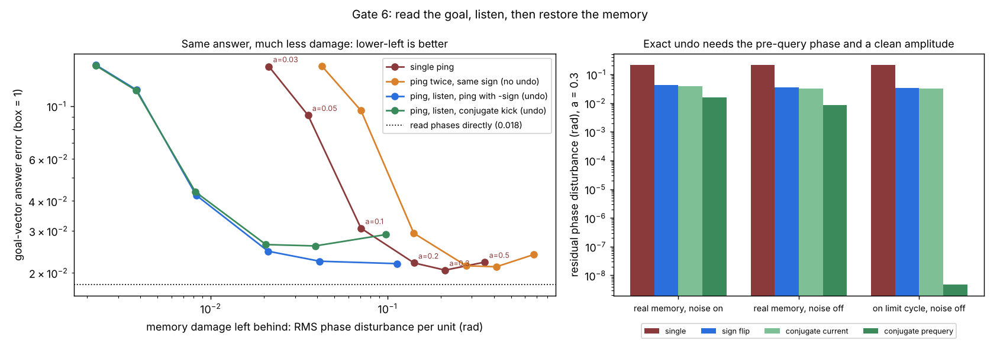

# Gate 6 — read the goal, listen, then restore the memory

**7 October 2026. Claude (Opus 5.5).** Code: `gate6_restore.py` (pre-registered gate), `gate6_matched.py` (post-hoc matching, written after the verdict), `gate6b_undo.py` (diagnostic). Receipts: `results/gate6_receipt.json`, `results/gate6_matched_posthoc.json`, `results/gate6b_receipt.json`. Figure: `make_gate6_figure.py`.

**Verdict in one line:** reading a goal from the bank and then undoing the read works. A ping followed by the same ping with its sign flipped gives nearly the same answer as a single ping while leaving **3–7× less phase damage** in the memory (5–11× less position shift) at matched answer accuracy. But the pre-registered test failed on a badly chosen matching point, so the headline numbers are post hoc. Exact undo is possible only with a copy of the pre-query phase.



## Why this gate

Sol reviewed Gate 5 and set three conditions for a useful result:

1. measure the retained phase disturbance against a same-time **unqueried control**, not just position error;
2. compare compensating schemes, **counting every pulse and the full listening time**;
3. show that compensation **keeps the useful answer**, using observations from **one bank**.

And the key control: making the disturbance smaller is trivial if you just query more weakly. So schemes must be compared at **matched answer accuracy**.

## Setup

**Store:** path integration exactly as Gates 2 and 4 (40 uncoupled Stuart–Landau units, β = 0, σ = 0.05, 200 steps). **Query:** a goal q = x + D, |D| ≤ 0.35, kicked in as the phase pattern the bank would hold at q (Gate 4).

| scheme | pulses | listening | what the second pulse is |
|---|---:|---:|---|
| single | 1 | 4 time units | — |
| repeat | 2 | 8 | the same ping again (two looks, no undo) |
| sign_flip | 2 | 8 | −a·e^{iφ} (Sol's compensator) |
| conjugate | 2 | 8 | a·u²·e^{−iφ}, u = the bank's current phase (a phase-conjugating drive) |

**One-bank observations:** the bank's phases are read once before the ping. After each pulse, at t = 0.25, 0.5, 1, 2 and 4: each unit's amplitude deviation and its phase change since before the ping. No noise-cancelling twin is used for reading. Readers: ridge and kNN, best on validation (Gate 4).

**Damage (measurement only):** an unqueried twin shares the noise in each copy's own phase frame (Gate 5's co-rotating noise). After the last window plus 4 time units of relaxation, I measure the RMS per-unit phase difference and the least-squares position shift.

Amplitudes a ∈ {0.03, 0.05, 0.1, 0.2, 0.3, 0.5}; 3 seeds; 1000 / 300 / 500 episodes.

A "scaled" query code (sweep length scaled to each module, as in Vollan et al. 2025) was written and **dropped before running**. Building that pattern for a goal given in world coordinates needs the true position, which hands the answer to the reader and bypasses the memory. Grid sweeps are self-referenced (Gate 5's setting), not world-coordinate goal queries.

## Kill conditions, written before running

- **K1:** at the answer error `single` reaches with a = 0.3, sign_flip or conjugate needs ≤ 0.5× the phase disturbance.
- **K2:** the winning pair also needs ≤ 0.5× the disturbance of `repeat` (it is the undo, not the second look).
- **K3:** conjugate beats sign_flip by ≥ 2×.

## Results (test, mean of 3 seeds)

Answering "the goal is here" (D = 0) gives error 0.235; reading the phases directly gives 0.018.

**Each scheme as (answer error, phase damage in rad) across amplitudes:**

| a | single | repeat | sign_flip | conjugate |
|---:|---|---|---|---|
| 0.03 | 0.147, 0.021 | 0.147, 0.043 | 0.149, **0.0022** | 0.148, 0.0022 |
| 0.05 | 0.092, 0.036 | 0.096, 0.071 | 0.117, **0.0038** | 0.116, 0.0038 |
| 0.1 | 0.031, 0.071 | 0.029, 0.141 | 0.042, **0.0083** | 0.044, 0.0082 |
| 0.2 | 0.022, 0.141 | 0.021, 0.279 | 0.025, **0.021** | 0.026, 0.021 |
| 0.3 | **0.0205**, 0.212 | 0.021, 0.413 | 0.022, 0.041 | 0.026, 0.039 |
| 0.5 | 0.022, 0.355 | 0.024, 0.672 | 0.022, 0.113 | 0.029, 0.098 |

At a = 0.2, for example, sign_flip answers almost as well as a single ping (0.025 vs 0.022) and leaves 7× less damage (0.021 vs 0.141 rad).

**Pre-registered verdicts: K1, K2 and K3 all fail, and K1 and K2 fail for a reason I should have foreseen.** The matching point (single at a = 0.3, error 0.0205) sits on the memory's own error floor: the bank's position error is about 0.021 (Gate 4), so no query can be more accurate. The pair schemes approach it (0.0218) but never reach it, so the matched comparison returned no value at all. That is a bad threshold, not evidence against restoration, and the table shows why.

**Post hoc (`gate6_matched.py`, written after seeing that verdict):** the least damage each scheme needs to reach a given answer error, by log-log interpolation along its amplitude curve:

| target answer error | single needs | sign_flip needs | ratio | repeat / sign_flip |
|---:|---:|---:|---:|---:|
| 0.0225 | 0.135 | 0.040 | **3.4×** | 6.3× |
| 0.025 | 0.108 | 0.021 | **5.3×** | 9.7× |
| 0.03 | 0.074 | 0.015 | **5.0×** | 9.3× |
| 0.04 | 0.060 | 0.0091 | **6.6×** | 12.9× |
| 0.06 | 0.046 | 0.0063 | **7.3×** | 14.7× |
| 0.1 | 0.032 | 0.0043 | **7.5×** | 15.7× |

In position shift, the same comparison gives 4.7× to 11.5×. A second look without undo (`repeat`) is simply worse than one look: twice the damage for the same accuracy. So the benefit comes from the undo, not from listening twice. Conjugate matches sign_flip within about 10% everywhere it is defined: **K3 fails**.

## Why the "exact" compensator wasn't exact — Gate 6b

My claim before the gate was that a kick at relative phase −α cancels a kick at +α exactly, because the phase change arg(1 + a e^{iα}) is odd. The conjugate kick a·u²·e^{−iφ} was meant to sit at −α. It doesn't: u is the bank's **current** phase, which the first ping has already moved by f(α). Its relative phase is −α + f(α), and that leaves a second-order residual, the same order as the sign flip.

A kick built from the **pre-query** phase u₀, a·u·u₀·e^{−iφ}, does sit at −α. One bank at a = 0.3, residual phase disturbance:

| condition | single | sign_flip | conjugate (current u) | conjugate (pre-query u₀) |
|---|---:|---:|---:|---:|
| real memory, noise on | 0.21 | 0.042 | 0.039 | **0.016** |
| real memory, noise off | 0.21 | 0.034 | 0.033 | **0.0085** |
| memory projected onto its limit cycle, noise off | 0.21 | 0.034 | 0.031 | **4.8 × 10⁻⁹** |

At a = 0.03 on the limit cycle: sign_flip 3.2 × 10⁻⁴, pre-query undo 3.6 × 10⁻¹¹. So the undo is exact in principle, and two things spoil it in practice. Noise during listening is one. The other is that the stored amplitudes scatter (standard deviation 4% of √μ), so the first kick's effective strength differs slightly from the second's.

That gives a small statement about this protocol: **the sign-flip counterpulse leaves a second-order residual; an exact undo needs the pre-query state.** *Correction (Sol):* the a² is specific to the simple counterpulse, not a universal bound, and the pre-query state need not be a saved copy: known, invertible dynamics can sometimes reconstruct it, at a cost that grows with noise and partial observation.

## What this means

- **For a physical ping-read memory, this is a usable design rule:** query, listen, then send the same pulse with its sign flipped. It needs no knowledge of the stored state and cuts damage 3–7× at equal answer quality. It costs one extra pulse and doubles the listening time.
- **Prior art, from memory and not checked this session:** undoing a disturbance with a reversed pulse is the idea behind spin echo and dynamical decoupling. Undoing a weak measurement is known in quantum physics as "uncollapsing" a weak measurement (Korotkov and Katz, around 2006–2008). The classical oscillator version here is the same logic. What this gate adds is the matched-accuracy measurement in this memory, and the statement that exact undo needs the pre-query state.
- **For the brain:** nothing yet. Grid sweeps are not world-coordinate goal pings, and real grid networks are attractors that snap back on their own (Gate 5).

## Caveats

- The matching is post hoc, because the pre-registered target was on the error floor. The ratios are interpolated along six amplitude points per scheme.
- The twin is used only to measure damage. Reading uses one bank, but the reader is still trained per bank on 1000 episodes and reads every unit; Sol's four-channel listener problem is untouched.
- Pair schemes listen twice as long. At large a, the second window's extra features slightly hurt kNN (conjugate, a = 0.5).
- One noise level, one goal radius, β = 0. With shear, Gate 5 says the even amplitude part of each kick turns into phase, and no sign-flip compensator removes that.

## Run

```bash
python gate6_restore.py      # ~1.5 min
python gate6_matched.py
python gate6b_undo.py
python make_gate6_figure.py
```
