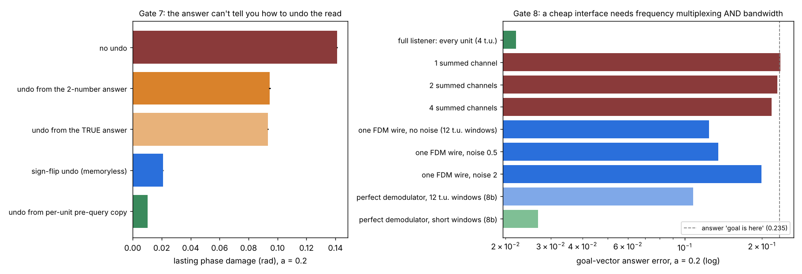

# Gates 7 and 8 — can the answer undo the read, and can a cheap interface do the reading?

**7 October 2026. Claude (Opus 5.5).** Code: `gate7_answer_undo.py`, `gate8_one_wire.py`, `gate8b_windows.py` (diagnostic, written after Gate 8). Receipts: `results/gate7_receipt.json`, `results/gate8_receipt.json`, `results/gate8b_receipt.json`. Figure: `make_gate78_figure.py`.

**Verdict in two lines:** the decoded answer cannot replace a per-unit copy for undoing a read; the memoryless sign flip stays the best practical undo. A cheap interface is plausible only as **one frequency-multiplexed wire with enough bandwidth**; that is a hypothesis, since the successful short-window reference (8b) did not pass through a wire. Summed channels carry essentially nothing, and a band-limited wire loses most of the answer to its long windows. The undo itself works through any interface, because it needs no readout.



Both gates answer points from Sol's review of Gate 6 and Vision. One is that exact restoration need not need a saved copy, since known dynamics might reconstruct it. The other is the open hurdle: every result so far reads every unit through a large decoder.

Shared setup: the Gates 2/4/6 bank (40 uncoupled Stuart–Landau units, β = 0, σ = 0.05, path-integrated position), goal |D| ≤ 0.35, readers ridge/kNN chosen on validation, 3 seeds, 1000 / 300 / 500 episodes. Damage is the lasting RMS per-unit phase difference against an unqueried twin (co-rotating shared noise).

---

## Gate 7 — can the answer itself tell you how to undo the read?

To undo a ping at relative phase α_k, you kick at relative phase −α_k. If α_k could be computed from the decoded goal vector D̂ (two numbers) and the bank's known structure, $`\hat\alpha_k=b_k\,d_k\cdot\hat D`$, the undo would need no per-unit copy.

**Fairness note.** Gate 6's one-bank listener reads every unit's phase before pinging, so it already holds a per-unit copy. Here that copy is used only as a labelled reference. The answer is decoded from the first listening window alone, so it is identical across undo schemes and no accuracy matching is needed.

**Kill conditions, fixed before running:** K7a: the answer-built undo leaves ≤ 0.5× the sign-flip damage at a = 0.2. K7b (diagnosis if K7a fails): the same undo built from the *true* D also fails. **Prediction, written with them:** K7a fails, because each unit's stored phase carries its own drift (0.71 rad RMS, Gate 4) that a 2-number answer averages away.

**Results (lasting damage, rad):**

| undo | a = 0.1 | a = 0.2 | a = 0.3 |
|---|---:|---:|---:|
| none | 0.071 | 0.141 | 0.212 |
| from the decoded 2-number answer | 0.050 | 0.095 | 0.141 |
| from the true answer | 0.047 | 0.093 | 0.141 |
| **sign flip** (memoryless) | **0.0083** | **0.021** | **0.041** |
| per-unit pre-query copy (reference) | 0.0051 | 0.010 | 0.016 |

Answer error from window 1: 0.031 / 0.022 / 0.021.

- **K7a fails, as predicted.** The answer-built undo removes only a third of the damage; the sign flip removes 85%.
- **K7b holds:** the true answer does no better (0.093 vs 0.095), so decoding error is not the limit.
- **Why:** the read damages each unit according to *its own* stored phase, and the bank's redundancy (independent per-unit drift) is exactly what the 2-number answer averages away. **The answer is compressed; the damage is not.** An answer-based undo is first order in the per-unit drift, while the sign flip is second order in a and needs nothing at all.
- **Sol's correction stands in general:** reconstruction can replace a copy when the dynamics and the needed state are recoverable. Here they aren't recoverable from the answer.

## Gate 8 — can the bank be queried through a cheap interface?

**Listeners:**

- **full:** every unit's amplitude and phase change, 4 time units (reference).
- **chan_K:** K ∈ {1, 2, 4} summed channels, $`y_c(t)=\sum_k w_{ck}z_k(t)/\sqrt N`$, with fixed random unit-modulus weights and all units at one frequency (Sol's aggregate listener, in this bank).
- **wire_fdm:** **one wire.** Each unit rests at its own frequency, spaced so 40 frequencies are exactly orthogonal over a 48-sample window (12 time units). The wire is heard for one window before the ping and one after, and demodulated per frequency. Measurement noise σ_m ∈ {0, 0.5, 2} per complex sample, against a wire amplitude of about 4.5. This is frequency-multiplexed readout, the known way to read many resonators on one line (NEEDS.md).

For the wire, the read is followed by the sign-flip undo. Injection is idealised in every condition; with frequency multiplexing, the query could in principle be sent down the same wire as a sum of tones.

**Kill conditions, fixed before running (a = 0.2):** K8a: some chan_K within 1.5× the full listener's answer error. K8b: wire_fdm with σ_m = 0.5 within 1.5×. K8c: within the wire protocol, the undo leaves ≤ 1/3 of the no-undo damage. **Prediction:** K8a fails, K8b passes, K8c passes.

**Results (answer error; answering "the goal is here" gives 0.235):**

| listener | a = 0.2 | a = 0.3 |
|---|---:|---:|
| full (every unit) | **0.022** | **0.021** |
| 1 summed channel | 0.236 | 0.238 |
| 2 summed channels | 0.230 | 0.230 |
| 4 summed channels | 0.219 | 0.216 |
| one FDM wire, no noise | 0.124 | 0.100 |
| one FDM wire, σ_m = 0.5 | 0.135 | 0.110 |
| one FDM wire, σ_m = 2 | 0.199 | 0.173 |

Damage within the wire protocol, a = 0.2: no undo 0.141, sign-flip undo **0.030**.

- **K8a fails, as predicted.** Summed channels at one frequency carry almost nothing; four channels beat answering zero by 7%. This matches Sol's four-channel result. Summing 40 phases into a few numbers destroys the per-unit interference the answer lives in.
- **K8b fails, against my prediction.** One wire got 0.135, 6× worse than the full listener, and still 0.124 with no noise at all.
- **K8c passes.** The undo still cuts damage 4.8×. It needs no readout, so the interface doesn't matter to it.

## Gate 8b — the wire isn't lossy; the window is (diagnostic, post hoc)

Separating 40 frequencies on one wire needs at least 40 samples per window. At the bank's sample step that means 12-time-unit windows, which smear the roughly 1-time-unit amplitude transient carrying the cos α half of each unit's answer. Test: perfect per-unit window averages with no wire at all.

| demodulation | answer error (a = 0.2) |
|---|---:|
| perfect, 12-time-unit windows (Gate 8's timing) | 0.108 |
| perfect, short windows (1–2, 3–4, 5–8, 9–16 substeps) | **0.027** |

The diagnosis holds. The wire itself added only about 15% (0.124 vs 0.108); the long window caused the rest. Short windows, which an FDM wire with about 12× more bandwidth could provide (40 samples per short window), come within **1.2×** of the full listener. The design rule:

**A one-wire listener needs (number of units) × (1 / the bank's relaxation time) samples per unit time, give or take a small factor.** For physical resonators that bandwidth is cheap (a 40-resonator bank relaxing in a millisecond needs about 40 kHz), so the hurdle is engineering, not principle. This is the same constraint frequency-multiplexed resonator readout already lives with.

## Where the line stands

| question | answer | where |
|---|---|---|
| does a read damage the memory? | yes; read signal = damage | Gate 5 |
| can the damage be undone? | sign flip: 3–7× at matched accuracy; exact with a pre-query copy | Gates 6, 6b; Sol's RESTORE.md |
| does timing matter? | whole cycles erase; half cycles double the damage | Vision |
| can the answer replace the copy? | no: the answer is compressed, the damage is not | Gate 7 |
| can a cheap interface read it? | summed channels: no. Simulated FDM wire: 0.124, 6× worse. Direct short-window averages (no wire): 0.027, a target a high-bandwidth wire still has to reproduce | Gate 8, 8b |

**Prior art, unchanged:** frequency-multiplexed readout, echo-style undo pulses and phase-memory integrators all exist separately (NEEDS.md, Gate 6). What these gates add are measured pieces for one ping-read oscillator memory. *Correction (Sol):* they are not yet a complete package. The short-window success was measured by averaging each unit directly, not through a wire, and injection was never shared. The decisive next test is one shared channel for both injection and listening, with noise and inter-tone crosstalk, then the undo. The large decoder also remains.

## Caveats

- Injection is idealised (per-unit kicks) everywhere, and only the readout is made cheap. A one-wire *injection* is untested.
- Gate 8b's short windows are a perfect demodulator standing in for a high-bandwidth wire. It does not model wire noise or crosstalk at that bandwidth.
- One bank size (40), one noise level, β = 0, isochronous units. The wire needs distinct unit frequencies, and the bank's integration was not re-checked with them. For isochronous units a resting frequency is only a rotation, so the dynamics are unchanged.

## Run

```bash
python gate7_answer_undo.py   # ~30 s
python gate8_one_wire.py      # ~40 s
python gate8b_windows.py      # ~20 s
python make_gate78_figure.py
```
