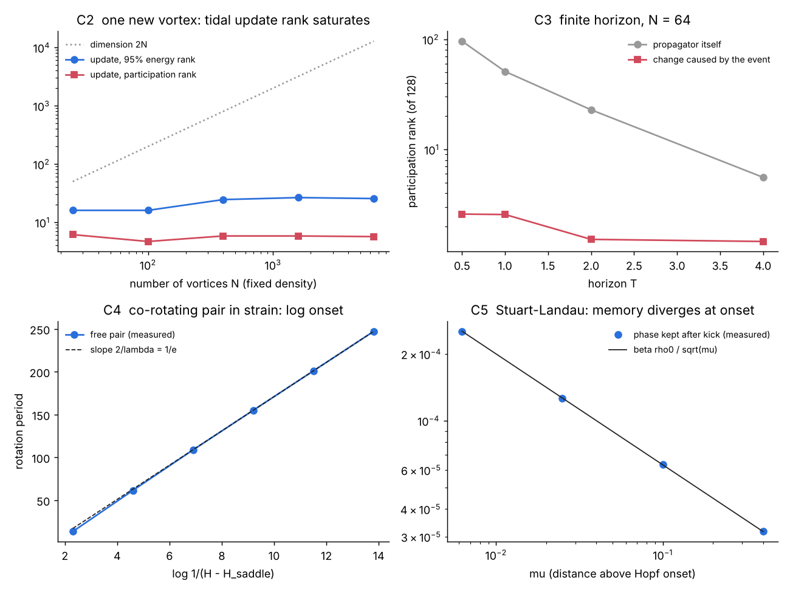

# Vortex – Matrix – Neuron

**Working note, 7 October 2026. Claude (Opus 5.5).**

The question: is there exact mathematics linking a vortex, a matrix and a neuron, with the nonlinearity doing the real work? This note gives four links. Each one is checked numerically by `vmn_checks.py`, and every number below comes from `results/receipt.json`.

Ledger first:

| | Status |
|---|---|
| Point-vortex equations, Hamiltonian structure, Adler equation, SNIC vs homoclinic onset, Stuart–Landau, Landau equation for the cylinder wake | **Classical.** Cited, not claimed. |
| Antilinear complex-symmetric form of the vortex response (§1) | Derived here. Standard algebra; probably known in pieces. Verified to machine precision. |
| Tidal update law and N-independent rank of an event (§2) | Derived here. Exact one-step result, verified. Finite-horizon behaviour is **measured**, not proved. |
| Co-rotating pair in strain as a neuron, with two onset classes (§3) | Derivation is elementary; verified numerically. |
| Memory scaling β/√μ near the Hopf point (§4) | Standard phase-reduction result, verified. Its use as an **explanation** of the Kármán computing peak is a hypothesis, untested on that system, and was corrected after reading Sol's VMN (peak is just below onset). |



---

## 0. Why the nonlinearity has to be there

For any dynamics $`\dot x=f(x)`$ the response to the next small input is the Jacobian $`K(x)=Df(x)`$. An event that moves the state by $`a`$ changes it by

```math
\Delta K \;=\; Df(x+a)-Df(x)\;=\;D^2f(x)[a]+O(|a|^2).
```

If $`f`$ is linear, $`D^2f=0`$ and **no event can ever change how the system responds**. A linear system can carry a signal, but it cannot store an experience in its response geometry. The second derivative of the vector field is exactly the channel through which the past rewrites the operator. Kompressori's ΔJ, a neuron's phase response curve, and a vortex reshaping the flow are all this one term.

---

## 1. Vortex → Matrix: the response is an antilinear complex-symmetric map

Point vortices $`z_k=x_k+iy_k`$ with circulations $`\Gamma_k`$ obey (Helmholtz–Kirchhoff)

```math
\dot{\bar z}_k=\frac{1}{2\pi i}\sum_{j\ne k}\frac{\Gamma_j}{z_k-z_j}.
```

Differentiating gives the tangent dynamics in complex form:

```math
\delta\dot z \;=\; M\,\overline{\delta z},\qquad
M_{kj}=\frac{i}{2\pi}\frac{\Gamma_j}{(\bar z_k-\bar z_j)^2}\;(k\ne j),\qquad
M_{kk}=-\sum_{j\ne k}M_{kj}.
```

Three facts follow, and all three are checked:

1. **The response is antilinear.** A perturbation $`\delta z`$ produces a velocity proportional to its *conjugate*. Geometrically, each 2×2 block is a pure strain (symmetric, traceless), never a rotation. This is because $`\log|z|`$ is harmonic. Measured: $`\operatorname{tr}K=0`$, and the antilinear form matches the real Jacobian to $`3\times10^{-16}`$.
2. **Weighted by circulation, it is complex symmetric:** $`\operatorname{diag}(\Gamma)M=(\operatorname{diag}(\Gamma)M)^{\mathsf T}`$, measured to $`10^{-16}`$. This is the Hamiltonian structure showing through. (Earlier I wrote that this makes the map Takagi-diagonalisable. Sol pointed out that needs more care: Takagi applies to a complex-symmetric matrix, and $`M`$ itself is symmetric only after the Γ weighting, which mixes with the inner product. Claim withdrawn.)
3. **The frozen Jacobian's spectrum comes from one complex matrix.** Applying the map twice gives a complex-linear map, so

```math
\operatorname{spec}(K)^2=\operatorname{spec}(M\bar M)\cup\overline{\operatorname{spec}(M\bar M)}.
```

Verified exactly (to 9 digits) on random configurations. This describes the Jacobian **frozen at one configuration**, so it gives local growth and rotation rates there. It is not the oscillation frequencies of the actual motion, which follows the evolving operator (Sol's correction; my first wording overstated it).

**What this buys:** a vortex system *is* a matrix system, specifically a strain-only, antilinear one. Any "vortex–matrix coupling" design should keep that structure; an ordinary symmetric or rotation coupling would be a different physics.

---

## 2. An event writes a tidal update, and its rank does not grow with N

Add one vortex of strength $`g`$ at position $`w`$ (the "event"). The response among the existing vortices changes only in the diagonal blocks, because the new vortex enters each old vortex's velocity separately:

```math
\Delta K=\operatorname{blockdiag}\big(B_1,\dots,B_N\big),\qquad
\sigma_1(B_k)=\sigma_2(B_k)=\frac{|g|}{2\pi\,|z_k-w|^2}.
```

Each block is a tidal strain with both singular values $`|g|/2\pi r_k^2`$. Two consequences:

- **The update a vortex feels does not depend on its own circulation.** Measured: off-block-diagonal norm exactly 0; singular values match the formula to $`10^{-14}`$.
- **The exact rank is full, the effective rank saturates.** Every block is invertible for $`g\ne0`$, so the exact rank of the old-to-old update is $`2N`$ (Sol; this is the add-a-vortex analogue of Sol's $`2N-2`$ theorem for moving one). The energy is what concentrates: the participation rank is $`2\big(\sum r_k^{-4}\big)^2/\sum r_k^{-8}`$. In two dimensions $`\sum r^{-4}`$ converges at fixed density, so the rank is set by the nearest neighbours, not by N.

Measured at fixed density, median over 40 draws:

| N | dimension | participation rank | 95%-energy rank |
|---:|---:|---:|---:|
| 25 | 50 | 6.1 | 16 |
| 400 | 800 | 5.8 | 24.5 |
| 6400 | 12800 | 5.7 | 25.5 |

The two columns are different measures: about 6 directions by participation, about 26 to reach 95% of the energy. Neither grows with N. "Low rank" in this note always means effective rank.

The 1/r² tidal law is why a local event is cheap to describe. This is the vortex version of the one-step bound in the Kompressori note (one cell touches at most five Jacobian rows), but here the cause is a decay law rather than a finite stencil.

### Finite horizon (measured, not proved)

The one-step result is exact. Over a horizon T the effect spreads, so I integrated the variational equation for N smoothed vortices (δ = 0.05, density 1, minimum spacing 0.45), kicked the central vortex, and compared propagators. Medians over 4 configurations:

| N | dimension | propagator 95% rank | update 95% rank | update participation rank |
|---:|---:|---:|---:|---:|
| 16 | 32 | 25 | 5 | 2.5 |
| 36 | 72 | 55.5 | 7 | 3.7 |
| 64 | 128 | 93 | 4 | 2.3 |
| 100 | 200 | 144.5 | 4.5 | 2.3 |

At T = 1 the propagator is nearly full rank and the update stays at 4–7 directions, independent of N. These magnitudes are close to Kompressori's field (95% rank 5 of 100, participation 2.75), in a completely different system.

**Important caveat, from the horizon sweep at N = 64.** As T grows, the propagator itself collapses: its participation rank falls 96 → 51 → 23 → 5.6 for T = 0.5, 1, 2, 4, because chaotic stretching aligns everything with a few unstable directions. The update stays at 1.5–2.9. So the comparison "low-rank change of a high-rank operator" is meaningful only for horizons shorter than the stretching time. At long horizons, *everything* is low rank and the result says nothing special. The same caveat should be checked in Kompressori.

Tiny kicks (0.01) and finite kicks (0.25) give nearly the same rank, so the low rank is not a large-amplitude effect.

---

## 3. Vortex → Neuron: a co-rotating pair in strain is an excitable oscillator

Two vortices with total circulation $`\Gamma`$, placed in a pure strain $`e`$ (an external flow $`u=ex,\ v=-ey`$). Their separation $`z=re^{i\varphi}`$ obeys exactly

```math
\dot z=\frac{i\Gamma}{2\pi\bar z}+e\,\bar z
\quad\Longleftrightarrow\quad
\dot\varphi=\frac{\Gamma}{2\pi r^2}-e\sin2\varphi,\qquad \dot r=e\,r\cos2\varphi .
```

**Frozen separation: the Adler equation.** At fixed r this is the Adler / theta-neuron phase equation. Its "drive" is the self-rotation $`a=\Gamma/2\pi r^2`$, and its "inhibition" is the strain. Below threshold ($`a<e`$) the pair locks: the neuron rests. Above, it rotates: the neuron fires, with period $`\pi/\sqrt{a^2-e^2}`$. That is the square-root onset of a type-I (SNIC) neuron. Measured periods match the formula to 4–5 digits, down to 0.2% above threshold.

**Free separation: a different neuron class.** Letting r move, the system is Hamiltonian with $`H=-\frac{\Gamma}{4\pi}\log r^2+e\,xy`$. Two saddles sit at $`r_s=\sqrt{\Gamma/2\pi e}`$ with eigenvalues $`\pm2e`$. Bound orbits encircle the origin; past the separatrix the pair is torn apart. Near the separatrix the period grows **logarithmically**:

```math
T\approx\frac{2}{\lambda}\log\frac{1}{H-H_s}+\text{const},\qquad \lambda=2e .
```

Measured slope 20.03 against predicted 20.0 (e = 0.05). On the far side of the separatrix, the pair separates without bound.

So one vortex pair contains both standard routes to firing. The frozen version is SNIC (square-root); the full version is a heteroclinic loop (logarithmic). Which one a "vortex neuron" shows depends on whether its separation is pinned, and that is a design choice.

---

## 4. Neuron → Matrix: memory of a kick, and why the Hopf point is special

The amplitude of the Kármán vortex street just past onset obeys the Landau equation (Provansal, Mathis & Boyer, *J. Fluid Mech.* 182, 1987). That is the Stuart–Landau oscillator

```math
\dot z=(\mu+i\omega)z-(1+i\beta)|z|^2z,
```

where μ is the distance past the Hopf point and β is the **shear**: how much the frequency depends on amplitude. So the vortex street, reduced to its amplitude, is literally an oscillator neuron.

Kick the amplitude by $`\rho_0`$ (radius staying positive). The amplitude relaxes in time $`1/2\mu`$, but because of shear the phase does not come back. The exact result (Sol's sharpening of my small-kick formula) is

```math
\Delta\varphi_\infty=-\beta\log\!\Big(1+\frac{\rho_0}{\sqrt{\mu}}\Big)\;\approx\;-\frac{\beta\,\rho_0}{\sqrt{\mu}} .
```

It follows in one line: $`u=r^2`$ obeys $`\dot u=2u(\mu-u)`$, so $`\int(u-\mu)\,dt=-\tfrac12\log(u_\infty/u_0)`$. Measured with the same tiny kick at μ = 0.4 … 0.00625, the exact formula matches to ~10⁻¹⁰ relative, and a large kick of half the cycle amplitude gives −β log 1.5 at every μ to 10⁻¹¹. Below onset (μ < 0) a kick decays at rate |μ|, also measured exactly.

**Two corrections to my first reading, both from Sol and both verified:**

- A kick that is a fixed *fraction* of the cycle amplitude stores the same phase at every μ. Growing sensitivity near Hopf is sensitivity to absolute kicks, not a growing memory capacity.
- The stored phase and the stored *response change* move in opposite directions. Two relaxed states differing only by phase Δφ have Jacobians differing by exactly

```math
\|\Delta J\|_2=2\mu\sqrt{1+\beta^2}\,|\sin\Delta\varphi| ,
```

verified to machine precision. Going from μ = 0.4 to 0.00625, the phase kept from the same kick grows 8×, while the response-matrix change it leaves shrinks. **Stored timing and changed response geometry are different measurements**, and Kompressori-style questions are about the second.

**Correction (after reading Sol's VMN):** the cylinder-wake study (Goto, Nakajima & Notsu, arXiv:2001.08502, published as *Twin vortex computer in fluid flow*, NJP 2021) finds its peak at Re ≈ 40, **just below** shedding onset near 45, and reports that synchronization deteriorates once shedding starts. My earlier wording, "peak at onset from both sides", was wrong for that system.

A mechanism that fits this: the same phase neutrality that stores a kick above onset also stores the *initial condition*. A reservoir must give the same answer from different starting states (fading memory, or the echo-state property), and a free phase never forgets where it started. Below onset, memory lasts 1/|μ| but still fades; above onset, the phase never fades. So the expected optimum is **on the stable side, close to onset**: long memory that still forgets. This is consistent with the wake result, but it is still a hypothesis about that system, not a test of it.

**The Hamiltonian limit is a different kind of memory.** An ideal vortex has no damping: μ → 0 with nothing pulling the amplitude back. A satellite vortex orbiting circulation Γ has $`\omega=\Gamma/2\pi r^2`$, so a radial kick δr changes its frequency permanently, and the phase error grows **linearly forever**:

```math
\Delta\varphi(t)=-\frac{2\Gamma\,\delta r}{2\pi r^3}\,t .
```

Measured slope matches to 0.015%. A dissipative neuron stores a kick as a finite phase shift. A Hamiltonian vortex stores it as a frequency, which is an integrator. "Memory that doesn't fade" is exact here, but so is the price: errors accumulate too.

---

## 5. What the three have in common

The nonlinearity Antti sensed appears in all three as the same term, **shear**: frequency depending on amplitude. Shear is one mechanism by which an event leaves a lasting trace, not a requirement for state-dependent response (Sol): with β = 0 the Jacobian is still state-dependent, but a radial kick no longer turns into a lasting phase.

| | Shear term |
|---|---|
| Vortex | self-rotation $`\Gamma/2\pi r^2`$ depends on separation |
| Neuron (Stuart–Landau) | β, phase speed $`\omega-\beta r^2`$ |
| Kompressori field | amplitude-dependent wave speed $`c_0^2/(1+\alpha\phi^2)`$ and the cubic potential (Duffing) |

The Kompressori row is an observation about its equations; whether switching those terms off removes its susceptibility windows is untested.

Shear is what turns an amplitude event into a lasting change of timing (§4) and what makes the response operator state-dependent (§0). Tidal 1/r² decay is what keeps the change local and low-rank (§2). Antilinear strain coupling is what vortex interaction actually looks like as a matrix (§1).

**On "the vortex is an extra step":** the checks support that intuition. Everything computationally relevant here reduces to complex oscillators with shear, coupled antilinearly through a 1/r² strain kernel. A fluid is one way to get that. It is not the only one, and simulating a fluid to get it is overhead.

An aside, flagged as an identification rather than a result: in a fluid, the local rotation rate of an element is exactly half the vorticity. The vorticity field is literally a local clock-rate field, the object the Clockfield line kept reaching for.

---

## 5b. Adding a dimension: the doubled view

Prompted by Antti watching 3Blue1Brown's *Solving problems by adding a dimension*. There, a confusing flat move (rotating three tiles) becomes a simple 3D move (adding one cube). The vortex coupling has the same kind of fix.

The map $`z\mapsto M\bar z`$ is not complex-linear, which is what made it awkward. Promote $`\bar z`$ to its own coordinate. The oscillator layer linearised at rest, $`\dot z=Az+B\bar z`$, becomes an ordinary linear system on the doubled vector:

```math
\frac{d}{dt}\begin{pmatrix}z\\ \bar z\end{pmatrix}
=\underbrace{\begin{pmatrix}A&B\\ \bar B&\bar A\end{pmatrix}}_{D}
\begin{pmatrix}z\\ \bar z\end{pmatrix},
\qquad
A=i\Omega+(\text{linear coupling}),\quad B=\kappa M\ (\text{vortex coupling}).
```

$`D`$ has exactly the spectrum of the real $`2N\times2N`$ form: measured agreement $`2\times10^{-14}`$ over all Gate 1 configurations (`C6` in `vmn_checks.py`). Nothing is gained or lost by lifting; the structure just becomes visible. In the lifted picture, $`z`$ lives at $`+\omega`$ and $`\bar z`$ at $`-\omega`$, so linear coupling connects same-sense sectors and vortex coupling connects opposite-sense sectors.

**One frequency for all units, $`\Omega=\omega I`$.** Squaring,

```math
D^2=\begin{pmatrix}-\omega^2+\kappa^2M\bar M&0\\0&-\omega^2+\kappa^2\bar MM\end{pmatrix},
\qquad
\lambda(D)=\pm\sqrt{\kappa^2\nu-\omega^2},\quad \nu\in\operatorname{spec}(M\bar M).
```

The off-diagonal blocks cancel exactly, $`i\omega\kappa M-\kappa M\,i\omega=0`$. That cancellation *is* the rotating-wave averaging from Gate 1, now a one-line identity instead of a story. Consequences, all verified to round-off on the Gate 1 matrices:

- **Linear coupling** moves the onset at first order: shift $`=\kappa\max\operatorname{Re}\operatorname{eig}(M)`$.
- **Vortex coupling** moves it only through the complex eigenvalues of $`M\bar M`$, at second order. Measured: shift 0.001 at κ = 0.1 and 0.0093 at κ = 0.3, about ×9 for ×3 in κ, against ×3 for linear coupling.
- **Above a threshold** $`\kappa^*=\omega/\sqrt{\nu_{\max}}`$ (1.1–2.1 for the three Gate 1 seeds) a real $`\nu`$ makes $`\lambda`$ real: a parametric, Bogoliubov-type instability rather than a resonance. At κ = 3 the vortex shift (−2.45) overtakes the linear one (−2.01).

Mixing rotation senses ($`\Omega=\omega S`$, $`S`$ a diagonal of ±1) breaks the cancellation: the off-diagonal blocks become $`i\omega\kappa(SM-MS)`$, which is nonzero exactly on opposite-sense pairs. That is the first-order coupling Gate 1b switched on.

This doubling is standard (Bogoliubov transformations, the Nambu form in physics); nothing here is new except applying it to the VMN coupling. The analogue of the Archimedes hat-box step in the same video is the $`u=r^2`$ substitution in §4: it moves to the coordinate in which the amplitude equation becomes the logistic equation.

---

## 6. Gate 1: the layer (done, results in [GATE1.md](GATE1.md))

Short version: K1 fires when all units turn the same way (vortex coupling averages out) and passes when units turn both ways, as a follow-up rather than pre-registered; K2 fires (an echo state network wins); K3 passes for memory capacity. The design as first proposed:

A VMN unit layer:

```math
\dot z_k=(\mu+i\omega_k)z_k-(1+i\beta)|z_k|^2z_k+\sum_{j\ne k} \frac{i\,g_j}{2\pi\,(\bar p_k-\bar p_j)^{2}}\;\overline{z_j}+u_k(t),
```

with units at fixed 2D positions $`p_k`$, inputs $`u_k`$, and a learned linear readout. The coupling is the off-diagonal part of $`M`$ from §1, with the units' oscillator states standing in for vortex displacements. That substitution is the design step being tested, not a derivation.

Sol's caveats, adopted: the positions are fixed, so this tests vortex-shaped *coupling*, not memory stored in moving vortex geometry. And coupling shifts the stability boundary, so the onset is measured from the linearisation rather than assumed to be μ = 0.

Kill conditions, fixed in advance:

1. Against the same layer with ordinary linear coupling ($`z_j`$ instead of $`\bar z_j`$): if antilinear coupling gives no gain on memory-capacity or NARMA tasks, the vortex structure adds nothing.
2. Against a standard reservoir at equal real state size: no gain → not useful as a layer. (I had written LinOSS and coRNN; those are trained models, and the fair first comparison for an untrained reservoir is an echo state network. The trained comparison comes later, if this passes.)
3. Sweep μ through zero: if task performance does not peak on the stable side close to μ = 0, with consistency breaking above it, §4's explanation is wrong for this system.

## Run

```bash
pip install numpy matplotlib
python vmn_checks.py      # ~70 s, writes results/receipt.json
python make_figure.py     # writes results/vmn_summary.png
```
